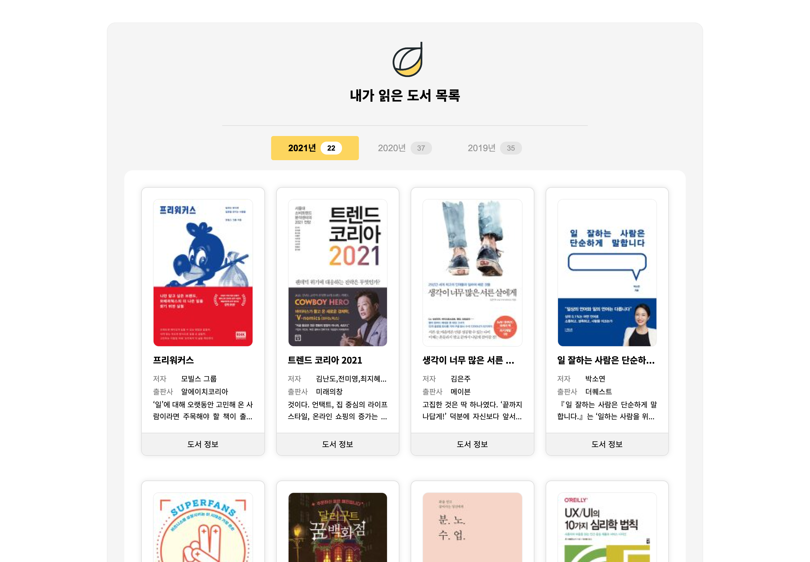

# myBook


- [프로젝트 보러가기](https://dreamfulbud.github.io/myBook/)
- 년도별로 제가 읽은 도서 목록를 정리한 페이지 입니다.
- 년도별 읽은 책과 읽은 권수를 확인할 수 있습니다.
- 개인프로젝트 : 100%

### 사용한 기술
- HTML / Sass(CSS) / JavaScript / jQuery / 카카오 도서 API 사용
- 위니브에서 제공한 실습 과제와 유튜브 조코딩님의 API 영상을 응용하여 작업하였습니다.

### 폴더구조
```
   .
   ├── img
   ├── index.html
   ├── script.js
   ├── scss
   │   └── style.scss
   └── style.css
```
## 개발하면서 어려웠던 점

1. 도서 소개 내용의 여러줄 말줄임을 적용하게 위해 넣은 코드 중. 해당 코드가 scss 파일 컴파일 시 지워지는 문제가 발생했다.

   ```css
   .contents {
   	-webkit-box-orient: vertical;
   }
   ```

   - 문제 해결) 컴파일된 파일과 scss 파일을 비교하고 지워진 코드만 별도 index파일에 style로 넣어주었다.

2. flex

   - 도서 목록(main ul li)을 flex / justify-content:space-between; 속성을 이용해 짜려고 했으나,
     마지막 행이 도서 개수에 따라 의도한 형태로 정렬이 되지 않았다.
   - 문제해결) 반응형등을 고려하면 Grid를 이용하는것이 더 좋을 것 같아 grid로 변경!

3. Grid

   - li의 컨텐츠때문인지 `grid-template-columns: repeat(4, 1fr);` css를 적용하니 contain 영역을 벗어나고 레이아웃 깨짐 현상이 발생했다.
   - 문제해결) 요소의 너비를 계산해서 넣어주었다.

     ```scss
     main {
     	ul {
     		// grid-template-columns: repeat(4, 1fr);
     		grid-template-columns: repeat(4, calc((100% - 2rem * 3) / 4));
     	}
     }
     ```

4. 코드 재사용
   - 처음 코드를 짤 때 첫 페이지에 로딩, 클릭 이벤트에 중복된 코드를 사용했었다.
   - 문제해결) 코드 재사용을 위해 코드를 정리하였다.

5. 랜덤 출력 현상
   - 년도 버튼 클릭 또는 새로고침 할 때마다 도서 목록이 랜덤으로 뿌려지는 현상이 있었다.
   - ajax를 사용하여 비동기식으로 가져오다보니 먼저 불러진 데이터부터 뿌려지는 것이 문제였다.
   - 문제해결1) ajax를 동기식으로 변경하여 문제를 해결했으나, 속도가 느려지는 문제가 발생했다.
      ```js
            $.ajax({
            async: false,
            })
      ```
   - 문제해결2) 속도가 느려지는 문제는 Loading 이미지를 넣어 시각적으로 처리하였다!
